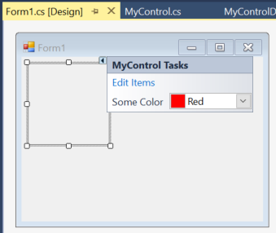

# Smart Tags (Task Panel or Custom Actions) for Control

This example shows how you can create a task panel or smart tags window for your control at designer:

To do so, you need to create a custom `Designer` for your control and in the designer, override its `ActionLists` property.

The example contains 3 main classes:

- `MyControl`: Here we decorate the control with `Designer` attribute to register the custom designer.
- `MyControlDesigner`: Here we override `ActionLists` and return a new `DesignerActionListCollection` containing the action list items which we need.
- `MyControlActionList`: Here we create properties which get/set out control properties. Also we create methods which are responsible to show custom editor for some properties or do some actions. Then return a list of action items by overriding `GetSortedActionItems`.
